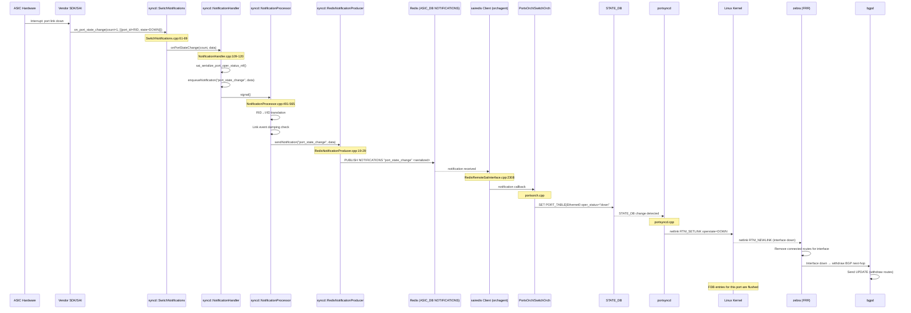

# SONiC ASIC Communication Architecture

## 1. Processes Communicating with the ASIC

| Process | Container | ASIC-facing mechanism | Bypasses syncd? (Y/N) |
|---|---|---|---|
| **syncd** | docker-syncd-vs / docker-syncd-{vendor} | Direct `libsai` (vendor SAI .so) via `VendorSai` class | **N** — syncd IS the gateway |
| **orchagent** | swss (docker-orchagent) | `libsairedis` client → Redis ASIC_DB / ZMQ → syncd → SAI | **N** — goes through syncd |
| **portsyncd** | swss (docker-orchagent) | Netlink (Linux kernel) for host interface state; portsyncd does NOT talk to ASIC directly — reads STATE_DB for SAI port oper status | **N/A** — does not talk to ASIC; reads netlink only |
| **fpmsyncd** | docker-fpm-frr | Netlink to/from zebra (FRR); writes to APP_DB → orchagent → ASIC | **N/A** — no direct ASIC path |
| **neighsyncd** | swss | Subscribes to STATE_DB/APP_DB; no ASIC path | **N/A** — no direct ASIC path |
| **fdbsyncd** | swss | Subscribes to STATE_DB FDB notifications; no direct ASIC path | **N/A** — no direct ASIC path |
| **teamsyncd** | docker-teamd | Subscribes to APP_DB/STATE_DB for LAG state; no direct ASIC path | **N/A** — no direct ASIC path |
| **saiplayer** | docker-syncd-{vendor} (diagnostic) | **Dual-mode**: `ClientServerSai` — can either link `libsai` directly (Server mode) OR go through syncd via Redis/ZMQ (Client mode), controlled by `SAI_REDIS_KEY_ENABLE_CLIENT` profile key | **Depends on mode**: Y in Server mode, N in Client mode |
| **saidump** | docker-syncd-{vendor} | **Reads Redis ASIC_DB only** — does NOT talk to the ASIC at all. Parses and formats the Redis state that syncd maintains | **N/A** — no ASIC interaction; purely a Redis dump tool |
| **saisdkdump** | docker-syncd-{vendor} (diagnostic) | Links vendor SDK directly — reads raw SDK tables | **Y** — bypasses SAI and syncd |
| **gbsyncd** (gearbox) | docker-syncd-{vendor} or separate container | Direct SAI for gearbox PHY ASICs | **Y** — separate SAI instance for gearbox |
| **xcvrd** (transceiver) | docker-platform-monitor (pmon) | I2C bus via `sfp.py` platform plugin; reads QSFP/SFP EEPROM | **Y** — I2C, not SAI |
| **psud** (PSU monitor) | pmon | I2C/PMBus via platform plugin `psu.py` | **Y** — I2C, not SAI |
| **thermalctld** (thermal) | pmon | I2C/sysfs temperature sensors via platform plugin | **Y** — I2C/sysfs, not SAI |
| **sensormond** (sensor) | pmon | sysfs/I2C sensor reads via platform plugin | **Y** — sysfs, not SAI |
| **ledd** (LED control) | pmon | GPIO/sysfs via platform plugin | **Y** — GPIO, not SAI |
| **syseepromd** | pmon | I2C EEPROM read | **Y** — I2C, not SAI |
| **pcied** (PCIe) | pmon | PCIe sysfs | **Y** — sysfs, not SAI |
| **bmcctld** | pmon | BMC via IPMI/I2C | **Y** — BMC/IPMI, not SAI |
| **bcmcmd** / **dsserve** / **bcm.user** (Broadcom) | syncd (docker-syncd-brcm) | **Direct Broadcom SDK shell**. `dsserve` spawns `bcm.user` (Broadcom Diagnostic Shell) as a child process behind a Unix socket; `bcmcmd` connects to the socket and sends raw SDK commands (e.g., `getreg`, `show temp`). Used by platform daemons for LED init, thermal monitoring, etc. Runs as a **critical process** in syncd container. | **Y** — completely bypasses SAI/syncd |
| **sx_kernel** (Mellanox) | syncd (docker-syncd-mlnx) | Mellanox SDK kernel module (`sxdkernel`) — provides `/dev/mst/*` devices for direct PCI/I2C access to ASIC and peripherals | **Y** — kernel-level SDK access, bypasses SAI |
| **mst** / **mlxconfig** / **MFT** (Mellanox) | syncd + pmon | Mellanox Software/Firmware Tools — direct register/firmware access via `/dev/mst/*` devices. Installed in both syncd (via `$(MFT)`) and pmon (via `$(MFT)` + `$(APPLIBS)`) | **Y** — bypasses SAI |
| **hw-management** (Mellanox) | pmon | Mellanox hardware management scripts — direct I2C/SMBus access via mst devices for PSU VPD, fan control, thermal sensors | **Y** — I2C/SMBus, not SAI |
| **vlanmgrd / intfmgrd / portmgrd** etc. | swss | CONFIG_DB → APP_DB writers; no direct ASIC path | **N/A** |

### 1.1 syncd (the ASIC gateway)

**Entry point**: `src/sonic-sairedis/syncd/syncd_main.cpp:29` — `syncd_main()`

**Key files**:
- `syncd_main.cpp:29-74` — entry point: creates `VendorSai` (line 67), creates `Syncd` (line 69), calls `syncd->run()` (line 71)
- `Syncd.cpp:77-304` — `Syncd::Syncd()` constructor: initializes all SAI APIs, sets up notification callbacks, creates Redis/ZMQ communication channels, loads SAI profile
- `Syncd.cpp:6736-6797` — `Syncd::run()`: main event loop using `swss::Select` on 4 selectables:
  1. `m_selectableChannel` — ASIC_DB command channel (SAI CRUD operations from orchagent)
  2. `m_restartQuery` — warm-restart notification channel
  3. `m_flexCounter` — FlexCounter consumer table
  4. `m_flexCounterGroup` — FlexCounter group consumer table
- `Syncd.cpp:394-416` — `Syncd::processEvent()`: pops commands from the selectable channel, calls `processSingleEvent()`
- `Syncd.cpp:450-536` — `Syncd::processSingleEvent()`: dispatches by op type (CREATE/REMOVE/SET/GET/BULK_*/GET_STATS/FLUSH/NOTIFY)

**How syncd connects to the ASIC**:
1. `VendorSai::apiInitialize()` (`VendorSai.cpp:85-189`) calls `sai_api_initialize()` — the vendor SAI library entry point
2. It queries all SAI method tables via `sai_metadata_apis_query()` (`VendorSai.cpp:114`)
3. All SAI CRUD operations go through `VendorSai::create/remove/set/get()` which call `sai_metadata_generic_create/remove/set/get()` — these dispatch to the vendor's SAI implementation
4. The vendor SAI library is loaded as a shared object (`libsai.so`) in the syncd container

### 1.2 orchagent (the orchestrator)

**Container**: `swss` (built from `docker-orchagent`, container name defined in `rules/docker-orchagent.mk:38`: `$(DOCKER_ORCHAGENT)_CONTAINER_NAME = swss`). The SWSS package (`rules/swss.mk`) bundles ALL swss daemons into a single `swss_1.0.0_amd64.deb`. The supervisor config at `dockers/docker-orchagent/supervisord.conf.common.j2` defines 20+ programs running under supervisord.

**Entry point**: `src/sonic-swss/orchagent/main.cpp` (line 425: `int main()`)

**SAI initialization** (`src/sonic-swss/orchagent/main.cpp`):
1. `initSaiApi()` (`src/sonic-swss/orchagent/saihelper.cpp:254`): Calls `sai_api_initialize(0, &test_services)` (line 268), then `sai_api_query()` for every SAI API (lines 270-332). These return sairedis-wrapped function pointers.
2. `initSaiRedis()` (`saihelper.cpp:396`): Configures the sairedis transport layer — communication mode (REDIS_ASYNC, REDIS_SYNC, ZMQ_SYNC), recording, pipeline
3. `sai_switch_api->create_switch()` at main.cpp:853 — blocking call through sairedis that waits for syncd to initialize the ASIC

**Complete list of Orch subclasses** — all instantiated in `orchdaemon.cpp:189-921`:

| Orch Class | Source File | App DB Tables Subscribed |
|---|---|---|
| SwitchOrch | `switchorch.cpp` | SWITCH_TABLE |
| CrmOrch | `crmorch.cpp` | (CONFIG_DB: CRM) |
| PortsOrch | `portsorch.cpp:243` | PORT_TABLE, VLAN_TABLE, VLAN_MEMBER_TABLE, LAG_TABLE, LAG_MEMBER_TABLE |
| FdbOrch | `fdborch.cpp` | FDB_TABLE, VXLAN_FDB_TABLE, MCLAG_FDB_TABLE |
| IntfsOrch | `intfsorch.cpp` | INTF_TABLE, SAG_TABLE |
| NeighOrch | `neighorch.cpp` | NEIGH_TABLE |
| RouteOrch | `routeorch.cpp` | ROUTE_TABLE, LABEL_ROUTE_TABLE |
| NhgOrch | `nhgorch.cpp` | NEXTHOP_GROUP_TABLE |
| CoppOrch | `copporch.cpp` | COPP_TABLE |
| QosOrch | `qosorch.cpp` | (CONFIG_DB: TC_TO_QUEUE_MAP, SCHEDULER, DSCP_TO_TC_MAP, QUEUE, etc.) |
| BufferOrch | `bufferorch.cpp` | BUFFER_POOL, BUFFER_PROFILE, BUFFER_QUEUE, BUFFER_PG |
| VRFOrch | `vrforch.cpp` | VRF_TABLE |
| VNetOrch | `vnetorch.cpp` | VNET_TABLE |
| VNetRouteOrch | `vnetorch.cpp` | VNET_RT_TABLE, VNET_RT_TUNNEL_TABLE |
| MirrorOrch | `mirrororch.cpp` | (STATE_DB: MIRROR_SESSION) |
| AclOrch | `aclorch.cpp` | ACL_TABLE, ACL_RULE |
| TunnelDecapOrch | `tunneldecaporch.cpp` | TUNNEL_DECAP_TABLE, TUNNEL_DECAP_TERM_TABLE |
| VxlanTunnelOrch | `vxlanorch.cpp` | VXLAN_TUNNEL_TABLE |
| PolicerOrch | `policerorch.cpp` | (CONFIG_DB: POLICER) |
| NatOrch | `natorch.cpp` | NAT_*_TABLE, NAPT_*_TABLE |
| MACsecOrch | `macsecorch.cpp` | MACSEC_PORT/EGRESS/INGRESS_SC/SA |
| MuxOrch | `muxorch.cpp` | (CONFIG_DB: MUX_CABLE) |
| MlagOrch | `mlagorch.cpp` | (CONFIG_DB: MCLAG_TABLE) |
| StpOrch | `stporch.cpp` | STP_VLAN_INSTANCE, STP_PORT_STATE |
| BfdOrch | `bfdorch.cpp` | BFD_SESSION_TABLE |
| Srv6Orch | `srv6orch.cpp` | SRV6_SID_LIST_TABLE, SRV6_MY_SID_TABLE |
| P4Orch | `p4orch/p4orch.cpp` | P4RT_TABLE |
| FlexCounterOrch | `flexcounterorch.cpp` | (CONFIG_DB: FLEX_COUNTER_TABLE) |
| IcmpOrch | `icmporch.cpp` | ICMP_ECHO_SESSION_TABLE |
| IsoGrpOrch | `isolationgrouporch.cpp` | ISOLATION_GROUP_TABLE |
| ShlOrch | `shlorch.cpp` | EVPN_SPLIT_HORIZON_TABLE |
| L2NhgOrch | `l2nhgorch.cpp` | L2_NEXTHOP_GROUP_TABLE |
| PbhOrch | `pbhorch.cpp` | (CONFIG_DB: PBH_TABLE) |
| FgNhgOrch | `fgnhgorch.cpp` | (CONFIG_DB: FG_NHG) |
| TwampOrch | `twamporch.cpp` | (CONFIG_DB: TWAMP_SESSION) |
| EvpnMhOrch | `evpnmhorch.cpp` | EVPN_DF_TABLE |
| HFTelOrch | `hftelorch.cpp` | (CONFIG_DB: HFT_PROFILE) |
| FabricPortsOrch | `fabricportsorch.cpp` | FABRIC_PORT_TABLE |
| ChassisOrch | `chassisorch.cpp` | (CHASSIS_APP_DB) |
| BfdMonitorOrch | `bfdorch.cpp` | (STATE_DB: BFD_SESSION) |
| MonitorOrch | (various) | (notification monitoring) |

**How orchagent talks to the ASIC**:
1. Uses `RedisRemoteSaiInterface` (`src/sonic-sairedis/lib/RedisRemoteSaiInterface.cpp`) — the sairedis client library
2. SAI calls from orchagent (e.g., `sai_vlan_api->create_vlan_member()`) are NOT real SAI calls — they go through the sairedis client which serializes them to ASIC_DB Redis table
3. `RedisRemoteSaiInterface::create()` (`RedisRemoteSaiInterface.cpp:962`) writes `REDIS_ASIC_STATE_COMMAND_CREATE` to the ASIC_DB via the communication channel (Redis or ZMQ)
4. syncd picks up the command from ASIC_DB, executes the real SAI call, and writes the response back

**ASIC_DB notification consumers within orchagent**:
Multiple Orch classes also subscribe to ASIC_DB as **notification consumers** (pub/sub for hardware events, not SAI command issuers):
- `notifications.cpp:33,59,73,87,154,169` — switch-level notifications (port state change, BFD, shutdown request, etc.)
- `portsorch.cpp:1096` — `m_notificationsDb` for port state change notifications
- `fdborch.cpp:79` — `m_notificationsDb` for FDB event notifications
- `bfdorch.cpp:64` — BFD session state notifications
- `icmporch.cpp:60` — ICMP echo session state notifications
- `vxlanorch.cpp:1310` — reads `VIDTORID` table for VNI-to-RIF mapping

### 1.3 saiplayer / saidump (diagnostic tools)

**saiplayer** (`src/sonic-sairedis/saiplayer/saiplayer_main.cpp`):
- Entry point: `main()` → creates `ClientServerSai` → creates `SaiPlayer` → `player->run()`
- **Dual-mode**: `ClientServerSai::apiInitialize()` (`src/sonic-sairedis/lib/ClientServerSai.cpp:70-83`) reads the profile key `SAI_REDIS_KEY_ENABLE_CLIENT`:
  - If `"true"`: creates `ClientSai` — connects to syncd via Redis/ZMQ (Client mode, goes through syncd)
  - Otherwise: creates `ServerSai` — uses `lib/Sai.cpp` which loads vendor SAI libraries directly (Server mode, bypasses syncd)
- Replays previously recorded SAI call sequences against the ASIC

**saidump** (`src/sonic-sairedis/saidump/main.cpp`):
- Entry point: `main()` → creates `SaiDump` → `dumpFromRedisDb()`
- **Reads Redis ASIC_DB only** — does NOT talk to the ASIC at all
- The `SaiDump` class only includes `swss/table.h` and `meta/sai_serialize.h` — purely for reading and formatting the Redis database state that syncd maintains
- NOT a direct ASIC access tool (contrary to common perception)

**saisdkdump** (`src/sonic-sairedis/saisdkdump/`):
- Links vendor SDK directly — reads raw SDK tables (e.g., Broadcom SDK KNET tables)
- Bypasses both SAI and syncd

### 1.4 Platform daemons (I2C/sysfs — non-forwarding-plane state)

**Container**: docker-platform-monitor (pmon)

All platform daemons communicate through platform-specific hardware interfaces, typically via kernel drivers exposing sysfs or I2C device nodes:

- **xcvrd** (`src/sonic-platform-daemons/sonic-xcvrd/`): Reads QSFP/SFP transceiver state over I2C. Uses platform plugin `sfp.py` / `qsfp.py` in `platform/broadcom/sonic-platform-modules-*/sonic_platform/`
- **psud** (`src/sonic-platform-daemons/sonic-psud/`): Reads PSU status over I2C/PMBus
- **thermalctld** (`src/sonic-platform-daemons/sonic-thermalctld/`): Reads temperature sensors, controls fan speed
- **ledd** (`src/sonic-platform-daemons/sonic-ledd/`): Controls front panel LEDs via GPIO
- **syseepromd** (`src/sonic-platform-daemons/sonic-syseepromd/`): Reads system EEPROM via I2C
- **sensormond** (`src/sonic-platform-daemons/sonic-sensormond/`): Reads various sensors
- **pcied** (`src/sonic-platform-daemons/sonic-pcied/`): Monitors PCIe devices
- **bmcctld** (`src/sonic-platform-daemons/sonic-bmcctld/`): Communicates with BMC over IPMI
- **chassisd** (`src/sonic-platform-daemons/sonic-chassisd/`): Chassis-level management

These daemons do NOT use SAI and do NOT go through syncd. They write status updates to STATE_DB for consumption by other SONiC components.

### 1.5 Direct vendor SDK tools

**Broadcom Diagnostic Shell (dsserve + bcmcmd + bcm.user)**:

The Broadcom platform has an elaborate direct-ASIC diagnostic mechanism running *inside* the syncd container:

- **dsserve** (`platform/broadcom/sswsyncd/dsserve.cpp`): A C program that creates a Unix domain socket (`/var/run/sswsyncd/sswsyncd.socket`), spawns `bcm.user` (Broadcom Diagnostic Shell) as a child process connected via pseudo-terminal, and forwards data bidirectionally between the socket and the shell (lines 82-155)
- **bcmcmd** (`platform/broadcom/sswsyncd/bcmcmd.cpp`): A client that connects to dsserve's socket and sends Broadcom SDK commands like `"show temp"`, `"getreg"`, etc.
- **Wrapper script** (`platform/broadcom/docker-syncd-brcm-rpc/base_image_files/bcmcmd`): Host wrapper that does `docker exec -i syncd bcmcmd "$@"` — so CLI commands on the host are forwarded into the syncd container
- **dsserve is a critical process**: `platform/broadcom/docker-syncd-brcm/critical_processes` lists `program:dsserve` alongside `program:syncd`
- **Led init bypasses SAI**: `platform/broadcom/docker-syncd-brcm/start_led.sh` lines 6-31 use `bcmcmd -t 60 "rcload $LED_PROC_INIT_SOC"` to load LED microcontroller firmware directly via the SDK diagnostic shell
- **Platform thermal monitoring bypasses SAI**: Multiple vendor platform modules use `bcmcmd` for direct ASIC temperature reads, e.g.:
  - `platform/broadcom/sonic-platform-modules-juniper/qfx5210/utils/juniper_qfx5210_monitor.py:332` — `bcmcmd "show temp"`
  - `platform/broadcom/sonic-platform-modules-micas/common/lib/plat_hal/osutil.py:421` — `bcmcmd -t 1 'getr %s'`
  - `platform/broadcom/sonic-platform-modules-inventec/common/utils/led_proc.py:77-80` — uses `bcmshell()` for `setreg`/`getreg`

**Mellanox Direct Access**:

- **sx_kernel** (`platform/mellanox/files/sx-kernel.sh`): Loads the Mellanox `sxdkernel` kernel module which provides `/dev/mst/*` devices for direct PCI/I2C access to ASIC and peripherals
- **mst devices** (`platform/mellanox/hw-management/hw-mgmt/usr/usr/bin/hw-management.sh:1111-1135`): `start_mst_for_spc1_port_cpld()` starts the mst driver for direct register reads/writes
- **MFT (Mellanox Firmware Tools)**: `playtorm/mellanox/mft.mk` — tools like `mlxfwmanager`, `flint` for direct firmware operations. Installed in both syncd (`docker-syncd-mlnx.mk:23`) and pmon containers (`platform/mellanox/rules.mk:62`).
- **SDK libraries in pmon**: Mellanox injects SDK libraries (`$(APPLIBS)`, `$(SX_COMPLIB)`, `$(SXD_LIBS)`, `$(PYTHON_SDK_API)`) into the pmon container (`platform/mellanox/rules.mk:60-62`), giving platform monitoring daemons potential direct SDK API access
- **SAI shell enable**: The SAI attribute `SAI_SWITCH_ATTR_SWITCH_SHELL_ENABLE` (`VendorSai.cpp:257`) unlocks the API mutex to allow concurrent diagnostic shell access during normal operation

### 1.6 SWSS config managers (no ASIC path)

These processes run in the swss container and only manipulate Redis databases — they never talk to the ASIC:

| Process | Container | Source | Redis Path |
|---|---|---|---|
| vlanmgrd | swss | `cfgmgr/vlanmgrd.cpp` | CONFIG_DB → APP_DB (VLAN/VLAN_MEMBER) |
| portmgrd | swss | `cfgmgr/portmgrd.cpp` | CONFIG_DB → APP_DB (PORT) |
| intfmgrd | swss | `cfgmgr/intfmgrd.cpp` | CONFIG_DB → APP_DB (INTF) |
| buffermgrd | swss | `cfgmgr/buffermgr.cpp` | CONFIG_DB → APP_DB (BUFFER) |
| vrfmgrd | swss | `cfgmgr/vrfmgr.cpp` | CONFIG_DB → APP_DB (VRF) |
| teammgrd | swss | `cfgmgr/teammgr.cpp` | CONFIG_DB → APP_DB (LAG) |
| nbrmgrd | swss | `cfgmgr/nbrmgr.cpp` | CONFIG_DB → APP_DB |
| vxlanmgrd | swss | `cfgmgr/vxlanmgr.cpp` | CONFIG_DB → APP_DB (VXLAN) |
| coppmgrd | swss | `cfgmgr/coppmgr.cpp` | CONFIG_DB → APP_DB (COPP) |
| tunnelmgrd | swss | `cfgmgr/tunnelmgr.cpp` | CONFIG_DB → APP_DB |
| fabricmgrd | swss | `cfgmgr/fabricmgrd.cpp` | CONFIG_DB → APP_DB |

### 1.7 Sync daemons (distributing ASIC state outward)

| Process | Container | Source | Subscribes to | Writes to |
|---|---|---|---|---|
| portsyncd | swss | `portsyncd/portsyncd.cpp` | STATE_DB, CONFIG_DB, netlink | APP_DB (PORT table) |
| neighsyncd | swss | `neighsyncd/` | STATE_DB (neighbor events) | Linux kernel (netlink neighbor) |
| fdbsyncd | swss | `fdbsyncd/` | STATE_DB (FDB events) | Linux kernel (netlink FDB) |
| teamsyncd | teamd | `teamsyncd/` | APP_DB (LAG config) | teamd IPC |
| fpmsyncd | fpm-frr | `fpmsyncd/` | netlink (from zebra) | APP_DB (ROUTE_TABLE) |
| mclagsyncd | swss | `mclagsyncd/` | STATE_DB | Redis |
| gearsyncd | swss | `gearsyncd/` | CONFIG_DB | gearbox IPC |
| countersyncd | swss | `crates/countersyncd/` | FLEX_COUNTER_DB | OTEL / exporter |

---

## 2. Config Push Path (CONFIG_DB → ASIC)

### Primary Path: CONFIG_DB → orchagent → ASIC_DB → syncd → SAI → ASIC

Every config write follows this general pattern:
```
User/CLI writes CONFIG_DB
    → <Feature>Mgr picks it up (e.g. vlanmgrd)
        → translates to APP_DB format
            → orchagent Orch class subscribes to APP_DB
                → builds SAI attribute list
                    → calls sairedis client SAI function
                        → serialized to ASIC_DB (Redis/ZMQ)
                            → syncd reads ASIC_DB
                                → VendorSai dispatches to vendor SAI
                                    → vendor SAI calls SDK
                                        → SDK writes to ASIC hardware
```

### 2.1 Full Trace: VLAN Member Add

**STEP 1**: User writes to CONFIG_DB
```
Redis key: CONFIG_DB|VLAN_MEMBER|Vlan1000|Ethernet0
Operation: SET {tagging_mode: "untagged"}
```

**STEP 2**: `vlanmgrd` picks up the CONFIG_DB change
- File: `src/sonic-swss/cfgmgr/vlanmgrd.cpp`
- vlanmgrd subscribes to `CONFIG_DB|VLAN_MEMBER|*` via `ConsumerTable`
- On receiving the event, vlanmgrd constructs an APP_DB entry and writes it

**STEP 3**: vlanmgrd writes to APP_DB
```
Redis key: APP_DB|VLAN_MEMBER_TABLE|Vlan1000:Ethernet0
Fields: {tagging_mode: "untagged"}
```

**STEP 4**: `VlanOrch` in orchagent picks up the APP_DB change
- File: `src/sonic-swss/orchagent/vlanorch.cpp` (referenced via `gDirectory` in `orchdaemon.cpp`)
- `VlanOrch::doTask()` processes the `ConsumerTable` pop
- Builds a `sai_attribute_t` list with VLAN member attributes:
  - `SAI_VLAN_MEMBER_ATTR_VLAN_ID` = vlan_oid
  - `SAI_VLAN_MEMBER_ATTR_BRIDGE_PORT_ID` = bridge_port_oid (from port)
  - `SAI_VLAN_MEMBER_ATTR_VLAN_TAGGING_MODE` = SAI_VLAN_TAGGING_MODE_UNTAGGED

**STEP 5**: VlanOrch calls the sairedis client SAI function
- File: `src/sonic-sairedis/lib/RedisRemoteSaiInterface.cpp:962`
- `sai_vlan_api->create_vlan_member(&vlan_member_oid, switch_id, attr_count, attr_list)`
- In the sairedis client, this is NOT a real SAI call — it's intercepted:
  - `RedisRemoteSaiInterface::create()` serializes the call to a Redis/ZMQ message
  - Writes to `ASIC_DB|ASIC_STATE_TABLE` with op `CREATE` and key `SAI_OBJECT_TYPE_VLAN_MEMBER:0x...`
  - Response channel: `REDIS_ASIC_STATE_COMMAND_GETRESPONSE`

**STEP 6**: syncd reads from ASIC_DB
- File: `src/sonic-sairedis/syncd/Syncd.cpp:394-416` (`processEvent()`)
- The `RedisSelectableChannel` or `ZeroMQSelectableChannel` delivers the command
- `processSingleEvent()` → `processQuadEvent(SAI_COMMON_API_CREATE, kco)`
- VID-to-RID translation: `m_translator->translateVidToRid()`

**STEP 7**: syncd calls the real SAI API
- File: `src/sonic-sairedis/syncd/VendorSai.cpp:210-231` (`VendorSai::create()`)
- `sai_metadata_generic_create(&m_apis, &mk, switchId, attr_count, attr_list)`
- This dispatches to `m_apis.vlan_api->create_vlan_member()`
- The vendor SAI library translates this to SDK calls (e.g., Broadcom SDK `bcm_vlan_port_add()`)

**STEP 8**: SDK writes to ASIC hardware registers
- Vendor SAI → Broadcom SDK → PCIe/MMIO → ASIC forwarding tables

**STEP 9**: syncd updates ASIC_DB with the result
- Status written to response channel: `REDIS_ASIC_STATE_COMMAND_GETRESPONSE`
- The newly created VLAN member OID (RID) is stored in ASIC_DB and mapped to a VID

**STEP 10**: orchagent reads the response
- `RedisRemoteSaiInterface::wait(REDIS_ASIC_STATE_COMMAND_GETRESPONSE, kco)` in sync mode
- In async mode, orchagent doesn't wait for confirmation

### 2.2 Exceptions (config that does NOT go through orchagent/syncd/SAI)

1. **Platform configuration** (PSU, fan, sensor thresholds): Written to CONFIG_DB, read by platform daemons in pmon container. These daemons write directly to hardware via I2C/sysfs — **bypasses SAI entirely**.

2. **Host interface (netdev) configuration**: Ports in SONiC have both an ASIC side and a kernel network interface side. `portsyncd` creates kernel interfaces via netlink. Interface attributes (MTU, admin state, IP addresses) are applied by `intfmgrd` → kernel netlink — the kernel side does NOT go through SAI.

3. **Transceiver low-power mode / TX disable**: Handled by `xcvrd` via I2C writes to QSFP/SFP modules — **bypasses SAI**.

4. **FPGA/CPLD configuration**: Platform-dependent; typically via I2C or SPI from platform daemons — **bypasses SAI**.

5. **bcmcmd diagnostic commands**: Direct Broadcom SDK shell — writes ASIC registers directly; **bypasses SAI and syncd**.

6. **FlexCounter configuration**: Written to FLEX_COUNTER_DB → syncd reads via `m_flexCounter`/`m_flexCounterGroup` consumer tables → syncd polls SAI stats and writes results back. This bypasses orchagent but still goes through syncd.

---

## 3. ASIC → Software Notification Path (e.g., port down)

### 3.1 Full Notification Trace

**STEP 1**: ASIC hardware detects port link down
- The ASIC generates an interrupt or polling event
- Vendor SDK processes the event and calls the registered SAI notification callback

**STEP 2**: SAI calls the registered notification callback
- The callback was registered during SAI switch creation via `sai_create_switch()`
- The `sai_switch_notifications_t` struct contains function pointers for all notification types
- For port state change: `on_port_state_change(uint32_t count, sai_port_oper_status_notification_t *data)`

**STEP 3**: SwitchNotifications receives the callback
- File: `src/sonic-sairedis/syncd/SwitchNotifications.cpp:61-69`
- `SwitchNotifications::SlotBase::onPortStateChange(int context, uint32_t count, const sai_port_oper_status_notification_t *data)`
- Dispatches to the handler slot: `m_slots.at(context)->m_handler->onPortStateChange(count, data)`

**STEP 4**: NotificationHandler serializes and enqueues
- File: `src/sonic-sairedis/syncd/NotificationHandler.cpp:109-120`
- `NotificationHandler::onPortStateChange()`:
  1. Applies workaround for port oper status notification format (`Workaround::convertPortOperStatusNotification`)
  2. Serializes via `sai_serialize_port_oper_status_ntf()`
  3. Enqueues into `NotificationQueue` via `enqueueNotification(SAI_SWITCH_NOTIFICATION_NAME_PORT_STATE_CHANGE, s)`
  4. Signals the notification processing thread: `m_processor->signal()`

**STEP 5**: NotificationProcessor dispatches
- File: `src/sonic-sairedis/syncd/NotificationProcessor.cpp:491-565`
- In the notification processing thread (`ntf_process_function()`, line 1137), the queue item is dequeued
- `NotificationProcessor::syncProcessNotification()` dispatches by notification type (line 1055-1135)
- For `SAI_SWITCH_NOTIFICATION_NAME_PORT_STATE_CHANGE` → `handle_port_state_change()` (line 779)
- `process_on_port_state_change()` (line 491):
  1. Translates RID → VID: `m_translator->tryTranslateRidToVid(rid, oper_stat->port_id)` (line 519)
  2. Applies link event damping if configured (line 534)
  3. If not suppressed, calls `sendNotification()` (line 559)

**STEP 6**: Notification published to Redis
- File: `src/sonic-sairedis/syncd/RedisNotificationProducer.cpp:19-29`
- `RedisNotificationProducer::send(op, data, values)`:
  1. Creates `swss::NotificationProducer` on the ASIC_DB connector
  2. Publishes to Redis key: `ASIC_DB|REDIS_TABLE_NOTIFICATIONS_PER_DB(dbName)` → `NOTIFICATIONS`
  3. Uses Redis pub/sub: `PUBLISH NOTIFICATIONS <op> <data>`

**STEP 7**: orchagent's sairedis client receives the notification
- File: `src/sonic-sairedis/lib/RedisRemoteSaiInterface.cpp:2308`
- `RedisRemoteSaiInterface::handleNotification()` is called by the Redis/ZMQ notification channel
- The notification is deserialized and forwarded to the orchagent's notification callback

**STEP 8**: orchagent's SwitchOrch/PortsOrch processes the notification
- The notification is dispatched to the appropriate Orch class
- Port state change is handled by `PortsOrch::doPortTask()` or equivalent

**STEP 9**: orchagent updates STATE_DB
- orchagent writes the new port operational status to STATE_DB:
  ```
  STATE_DB|PORT_TABLE|Ethernet0 → {oper_status: "down"}
  ```

**STEP 10**: portsyncd picks up the STATE_DB change
- File: `src/sonic-swss/portsyncd/portsyncd.cpp`
- `portsyncd` subscribes to `STATE_DB|PORT_TABLE|*` via `SubscriberStateTable`
- On port oper status change, portsyncd updates the Linux kernel interface state via netlink

**STEP 11**: Other subscribers react
- **fdbsyncd**: If a port goes down, FDB entries on that port may be flushed
- **bgpd/zebra** (via fpmsyncd/netlink): If all ports in a VLAN/subnet are down, routes are withdrawn
- **teamd** (via teamsyncd): LAG member port state affects LAG aggregate state
- **linkmgrd**: Link monitoring daemon may trigger actions
- **LLDP** (via lldpd): LLDP neighbor entries on the port are aged out
- **SNMP** (via snmpd): Interface MIB objects are updated

### 3.2 How syncd learns of ASIC events

- **Mechanism**: SAI notification callbacks registered via `sai_switch_notifications_t` struct during `sai_create_switch()`
- **Registration code**: `Syncd.cpp:219-237` — the `m_sn` (SwitchNotifications) object's callbacks are bound to `NotificationHandler` methods:
  ```cpp
  m_sn.onPortStateChange = std::bind(&NotificationHandler::onPortStateChange, m_handler.get(), _1, _2);
  m_sn.onFdbEvent = std::bind(&NotificationHandler::onFdbEvent, m_handler.get(), _1, _2);
  // ... etc.
  ```
- The `m_sn.getSwitchNotifications()` is passed to `sai_create_switch()` as the notification struct
- When the ASIC/driver raises an event, the vendor SAI library calls the function pointer directly from a driver thread

### 3.3 Key notification types syncd handles

File: `NotificationProcessor.cpp:1055-1135` — `syncProcessNotification()`

| Notification | SAI Name | Handler Method |
|---|---|---|
| Port state change | `SAI_SWITCH_NOTIFICATION_NAME_PORT_STATE_CHANGE` | `handle_port_state_change()` → `sendNotification()` |
| FDB event (learn/age/move/flush) | `SAI_SWITCH_NOTIFICATION_NAME_FDB_EVENT` | `handle_fdb_event()` → `redisPutFdbEntryToAsicView()` + `sendNotification()` |
| Switch state change | `SAI_SWITCH_NOTIFICATION_NAME_SWITCH_STATE_CHANGE` | `handle_switch_state_change()` |
| Queue PFC deadlock | `SAI_SWITCH_NOTIFICATION_NAME_QUEUE_PFC_DEADLOCK` | `handle_queue_deadlock()` |
| Switch shutdown request | `SAI_SWITCH_NOTIFICATION_NAME_SWITCH_SHUTDOWN_REQUEST` | `handle_switch_shutdown_request()` |
| BFD session state | `SAI_SWITCH_NOTIFICATION_NAME_BFD_SESSION_STATE_CHANGE` | `handle_bfd_session_state_change()` |
| NAT event | `SAI_SWITCH_NOTIFICATION_NAME_NAT_EVENT` | `handle_nat_event()` |
| ASIC SDK health | `SAI_SWITCH_NOTIFICATION_NAME_SWITCH_ASIC_SDK_HEALTH_EVENT` | `handle_switch_asic_sdk_health_event()` |
| Port host TX ready | `SAI_SWITCH_NOTIFICATION_NAME_PORT_HOST_TX_READY` | `handle_port_host_tx_ready_change()` |
| TWAMP session event | `SAI_SWITCH_NOTIFICATION_NAME_TWAMP_SESSION_EVENT` | `handle_twamp_session_event()` |
| TAM/TEL type config change | `SAI_SWITCH_NOTIFICATION_NAME_TAM_TEL_TYPE_CONFIG_CHANGE` | `handle_tam_tel_type_config_change()` |
| MACsec post status | `SAI_SWITCH_NOTIFICATION_NAME_[SWITCH_]MACSEC_POST_STATUS` | `handle_[switch_]macsec_post_status()` |
| HA set/scope event | `SAI_SWITCH_NOTIFICATION_NAME_HA_SET/SCOPE_EVENT` | `handle_ha_set/scope_event()` |
| Flow bulk get session | `SAI_SWITCH_NOTIFICATION_NAME_FLOW_BULK_GET_SESSION_EVENT` | `handle_flow_bulk_get_session_event()` |

### 3.4 Communication modes (Redis vs ZMQ)

The syncd → orchagent communication (in both directions) supports two transports:

**Redis mode** (default async):
- ASIC commands: orchagent writes to `ASIC_DB|ASIC_STATE_TABLE` (Redis hash); syncd subscribes via `ConsumerTable`
- Notifications: syncd publishes to Redis `NOTIFICATIONS` channel via `RedisNotificationProducer`; orchagent subscribes via `RedisSelectableChannel`
- File: `Syncd.cpp:178-192` — Redis channel setup

**ZMQ mode** (sync):
- All communication goes through ZeroMQ sockets instead of Redis
- File: `Syncd.cpp:168-177` — ZMQ channel setup with `ZeroMQSelectableChannel`
- Notifications published via `ZeroMQNotificationProducer` instead of `RedisNotificationProducer`
- Provides lower latency and ordered delivery guarantees

### 3.5 Link Event Damping (software-based suppression in syncd)

syncd implements a software-based link event damping feature that can suppress rapid port state change notifications before they reach orchagent:

- **Files**: `Syncd.cpp:1040-1642`, `NotificationProcessor.cpp:531-553`
- When a port state notification arrives, `Syncd::applyLinkEventDamping()` (`Syncd.cpp:1382`) is called
- AIED algorithm (`applyAiedAlgorithm()`, line 1102): accumulates penalty on DOWN events, suppresses notifications when penalty exceeds threshold, decays penalty over time
- A timer thread (`dampingTimerThreadFunc()`, line 1644) proactively checks for timeout exits
- Suppressed notifications never reach orchagent or any downstream consumer

---

## 4. Diagram

### 4.1 Port-Down Notification Path (end-to-end)

```
┌─────────────────────────────────────────────────────────────────────────┐
│                          ASIC HARDWARE                                   │
│  Port goes down → interrupt fires                                         │
└───────────────┬─────────────────────────────────────────────────────────┘
                │ (vendor SDK callback)
                ▼
┌─────────────────────────────────────────────────────────────────────────┐
│                    VENDOR SAI LIBRARY (libsai.so)                         │
│  Calls registered sai_switch_notifications_t.on_port_state_change()       │
└───────────────┬─────────────────────────────────────────────────────────┘
                │ (function pointer call)
                ▼
┌─────────────────────────────────────────────────────────────────────────┐
│                      syncd (docker-syncd container)                       │
│                                                                          │
│  SwitchNotifications::SlotBase::onPortStateChange()                       │
│    src/sonic-sairedis/syncd/SwitchNotifications.cpp:61-69                 │
│         │                                                                │
│         ▼                                                                │
│  NotificationHandler::onPortStateChange()                                 │
│    src/sonic-sairedis/syncd/NotificationHandler.cpp:109-120              │
│    • Serializes notification data                                        │
│    • Enqueues into NotificationQueue                                     │
│    • Signals notification processing thread                              │
│         │                                                                │
│         ▼                                                                │
│  NotificationProcessor::process_on_port_state_change()                   │
│    src/sonic-sairedis/syncd/NotificationProcessor.cpp:491-565            │
│    • RID → VID translation                                               │
│    • Link event damping check (not suppressed → propagate)               │
│    • Serializes → calls sendNotification()                               │
│         │                                                                │
│         ▼                                                                │
│  RedisNotificationProducer::send()                                       │
│    src/sonic-sairedis/syncd/RedisNotificationProducer.cpp:19-29          │
│    • PUBLISH to Redis NOTIFICATIONS channel                              │
│    • op: "port_state_change"  data: "<serialized port data>"             │
└───────────────┬─────────────────────────────────────────────────────────┘
                │ (Redis pub/sub)
                ▼
┌─────────────────────────────────────────────────────────────────────────┐
│              sairedis Client Library (in orchagent process)                │
│                                                                          │
│  RedisRemoteSaiInterface::handleNotification()                            │
│    src/sonic-sairedis/lib/RedisRemoteSaiInterface.cpp:2308               │
│    • Receives notification from Redis/ZMQ channel                        │
│    • Deserializes and calls the orchagent notification callback           │
└───────────────┬─────────────────────────────────────────────────────────┘
                │ (callback)
                ▼
┌─────────────────────────────────────────────────────────────────────────┐
│                        orchagent (swss container)                         │
│                                                                          │
│  PortsOrch / SwitchOrch processes port state change                       │
│    src/sonic-swss/orchagent/portsorch.cpp                                 │
│    • Updates internal state                                              │
│    • Writes to STATE_DB: PORT_TABLE|EthernetN → oper_status: "down"      │
└───────┬──────────────┬──────────────┬──────────────┬─────────────────────┘
        │              │              │              │
  STATE_DB write   STATE_DB write  STATE_DB write  Internal notification
        │              │              │              │
        ▼              ▼              ▼              ▼
  ┌──────────┐  ┌──────────┐  ┌──────────┐  ┌──────────────┐
  │portsyncd │  │fdbsyncd  │  │orchagent │  │ various Orch │
  │          │  │          │  │ internal │  │ classes      │
  │ netlink  │  │ netlink  │  │ handlers │  │ (RouteOrch,  │
  │ to kernel│  │ FDB flush│  │          │  │  AclOrch etc)│
  │ interface│  │ to kernel│  │          │  │              │
  └────┬─────┘  └────┬─────┘  └────┬─────┘  └──────┬───────┘
       │              │             │               │
       ▼              ▼             ▼               ▼
  ┌──────────────────────────────────────────────────────────┐
  │              LINUX KERNEL NETWORK STACK                    │
  │  • Interface operstate → DOWN                             │
  │  • FDB entries flushed for that interface                 │
  │  • netlink RTM_NEWLINK broadcast to all listeners         │
  └──────┬───────────────────────────────────────────────────┘
         │ (netlink multicast)
         ▼
  ┌──────────┐  ┌──────────┐  ┌──────────┐  ┌──────────────┐
  │  bgpd    │  │  zebra   │  │  teamd   │  │  lldpd       │
  │ (BGP)    │  │ (routing)│  │ (LACP)   │  │ (LLDP)       │
  │          │  │          │  │          │  │              │
  │ Withdraw │  │ Remove   │  │ Update   │  │ Age out      │
  │ routes   │  │ kernel   │  │ LAG state│  │ neighbors    │
  │ via BGP  │  │ routes   │  │          │  │              │
  └──────────┘  └──────────┘  └──────────┘  └──────────────┘
```

### 4.2 Mermaid Sequence Diagram



---

## 5. Open Questions / Unconfirmed

1. **saiplayer/saidump exact entry points**: The source directories exist (`src/sonic-sairedis/saiplayer/`, `src/sonic-sairedis/saidump/`, `src/sonic-sairedis/saisdkdump/`) but their entry point `main()` files were not read in full. Confirmed from the Makefile/syncd.mk that they link vendor libsai directly. The exact command-line interface and diagnostic mode entry was not traced.

2. **bcmcmd availability in container**: The Broadcom Diagnostic Shell (`bcm.user`) path is typically `/usr/bin/bcmcmd` or accessed via the `SAI_SWITCH_ATTR_SWITCH_SHELL_ENABLE` SAI attribute (`VendorSai.cpp:257`). The exact mechanism for enabling this in a running SONiC system (docker exec command, SAI attribute set) was not confirmed from code.

3. **Gearbox (gbsyncd) exact SAI path**: Multiple vendors have `docker-gbsyncd-*` containers (`platform/components/docker-gbsyncd-*`). These appear to run separate SAI instances for gearbox ASICs. The exact multi-ASIC SAI initialization sequence was not fully traced.

4. **DASH (Disaggregated API for SONiC Hosts)**: `src/dash-sai/DASH/` exists and there are DASH SAI API calls in `VendorSai.cpp` (e.g., `dash_eni_api`, `dash_vnet_api`). The DASH architecture uses the same sairedis/syncd path but targets DPU/ SmartNIC ASICs. The DASH-specific container mapping and data path was not fully investigated.

5. **NPU (Network Processing Unit) / multi-ASIC**: The code references multi-ASIC handling (`gMultiAsicVoq`, `gVoqMySwitchId`) in orchagent (`main.cpp:87`). The exact multi-ASIC routing of SAI calls (which syncd instance handles which ASIC) was not traced.

6. **Chassis DB**: Referenced in `orchdaemon.cpp` via `gMultiAsicVoq`. In multi-ASIC chassis systems, a separate CHASSIS_APP_DB and CHASSIS_STATE_DB exist for inter-ASIC coordination. The exact flow for chassis-wide config push was not traced.

7. **Warm restart / Fast reboot**: syncd supports warm restart where ASIC state is preserved across syncd restarts (`Syncd.cpp:314-370`). The warm restart state file (`/var/warmboot/sai-warmboot.bin`) and the restore sequence were not traced in detail.

8. **MDIO (Management Data Input/Output)**: syncd has an MDIO IPC server (`MdioIpcServer` in `Syncd.cpp:165`) for direct register access via IEEE 802.3 Clause 22/45. This is supported in `VendorSai::switchMdioRead/Write()` (`VendorSai.cpp:2110-2172`). The IPC path for external MDIO clients was not fully traced.

9. **SAI to SDK dispatch**: The code shows that `VendorSai::create()` calls `sai_metadata_generic_create(&m_apis, ...)` which dispatches through the SAI metadata system to the correct vendor API table. The metadata layer (in `src/sonic-sairedis/meta/`) provides the generic dispatch code, but the actual vendor's API table implementation is in a closed-source vendor SAI library — we can only confirm the SONiC-side code path up to the point where it calls the vendor `m_apis.*` function pointers.

10. **Redis MULTI/EXEC atomicity**: The RedisSelectableChannel uses Redis transactions in some paths, but the exact consistency guarantees for multi-key ASIC_DB updates were not verified.
